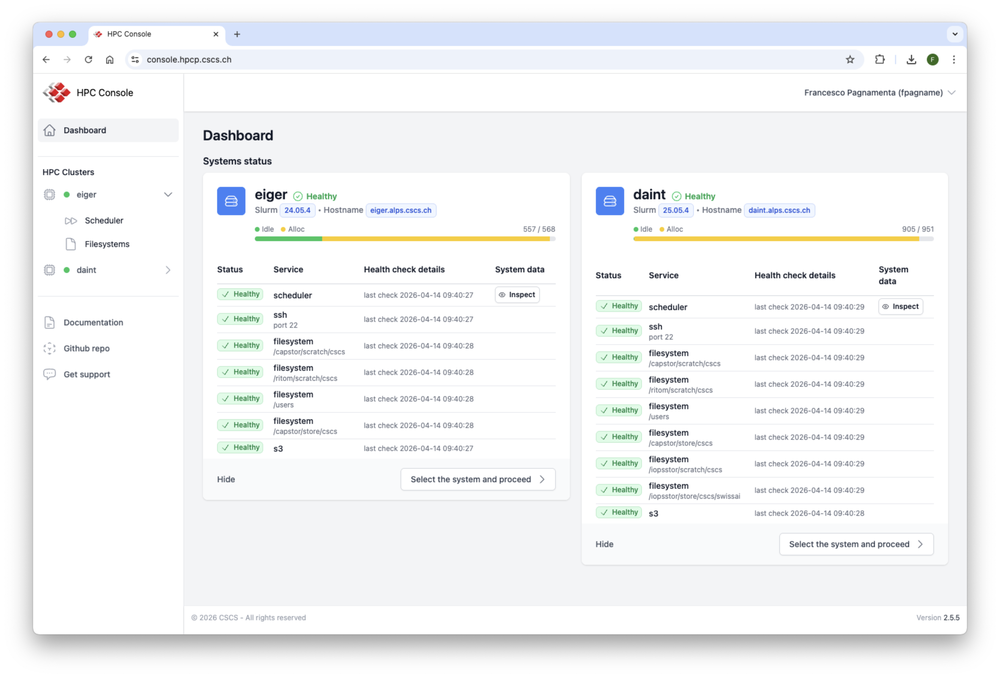
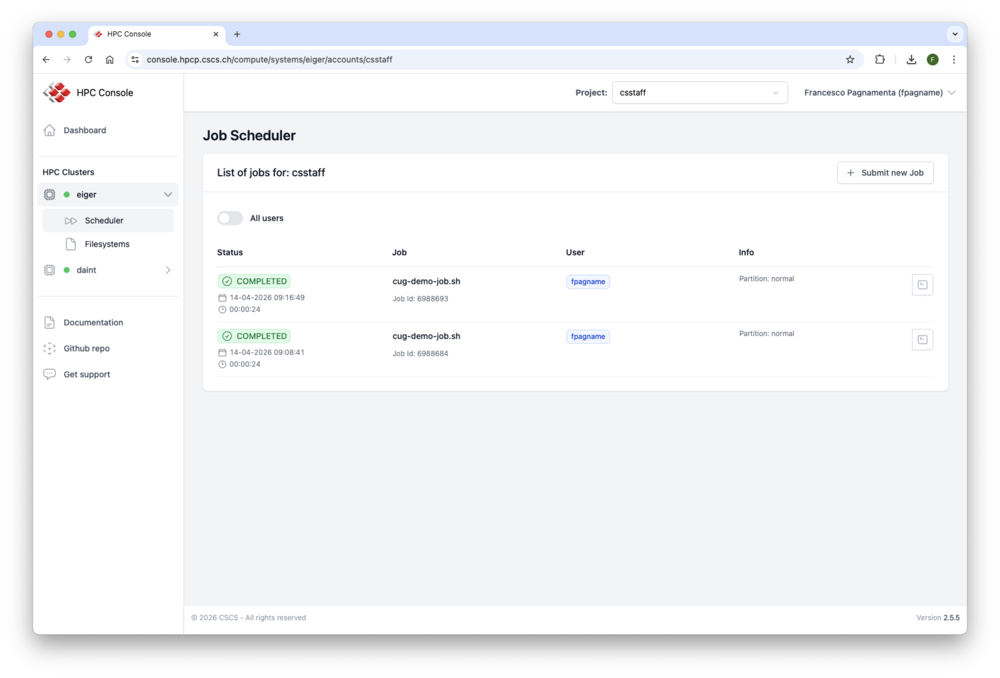
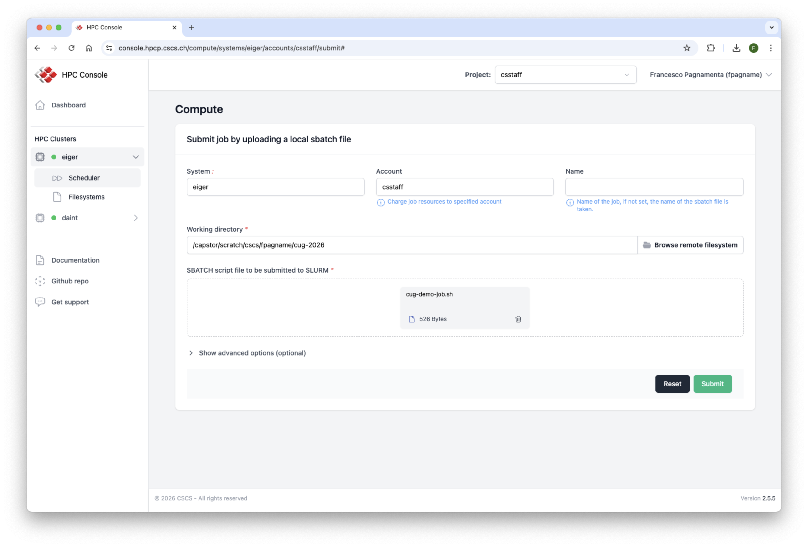
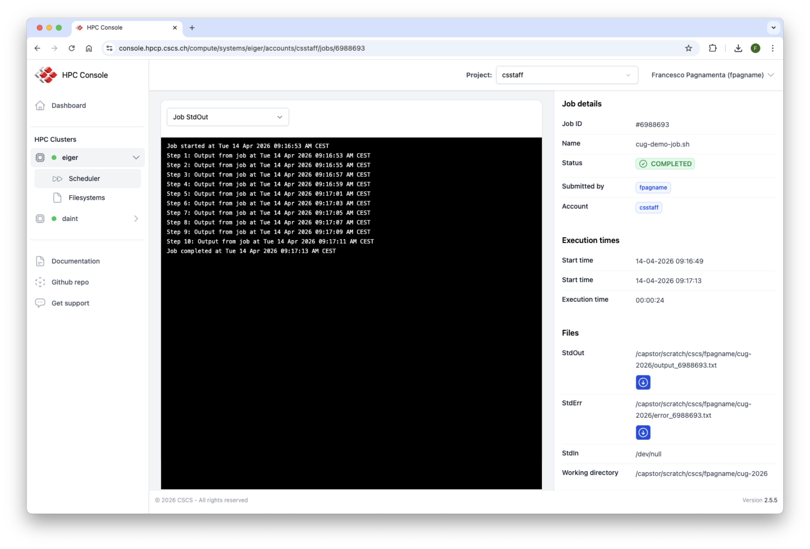
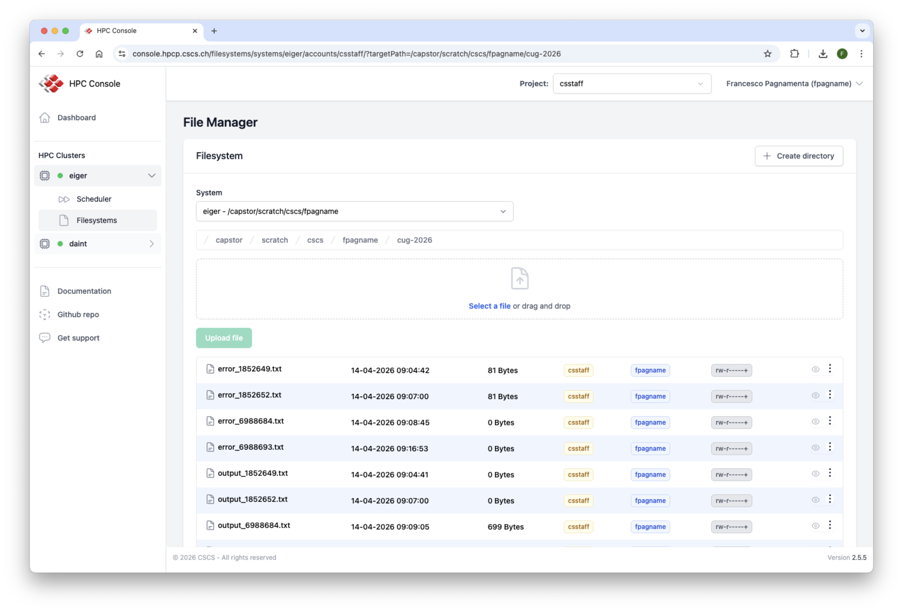

# FirecREST UI Documentation

## Dashboard

The dashboard provides an overview of accessible clusters and their health status. Each cluster card shows the system's health, SLURM and filesystem service checks, and a link to navigate to the system.

## Job Scheduler

### Job Scheduler View

The Job Scheduler lists all jobs for the selected account, showing their status, name, submitting user, and partition. New jobs can be submitted using the **Submit new Job** button at the top-right.

### Submit a Job

Clicking **Submit new Job** opens a form to submit a new SLURM batch job. It requires selecting a system, account, and optionally a job name and working directory. A local SLURM script file must be provided. Advanced options are available via a collapsible section.

### Job Details

Clicking a job opens its detail page with a split layout: the left panel displays the job's standard output, and the right panel shows metadata including Job ID, status, submitting user, execution times, and download links for StdOut, StdErr, and StdIn files.

## File Manager

The File Manager lists files for a specific cluster and account. Users can navigate the directory tree and perform basic file operations (e.g., copy, move, rename, delete, create directory).

Files can be uploaded via drag-and-drop or file selection, and downloaded individually. File uploads are handled transparently based on file size:
- Files smaller than 5MB are uploaded directly.
- Larger files require a file transfer job (typically via S3 storage).

Known file types (text, images, PDF) under 5MB can also be previewed directly in the browser without downloading.

