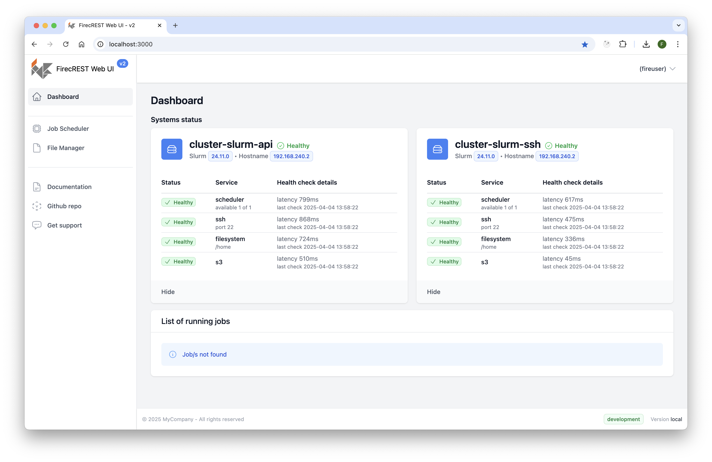
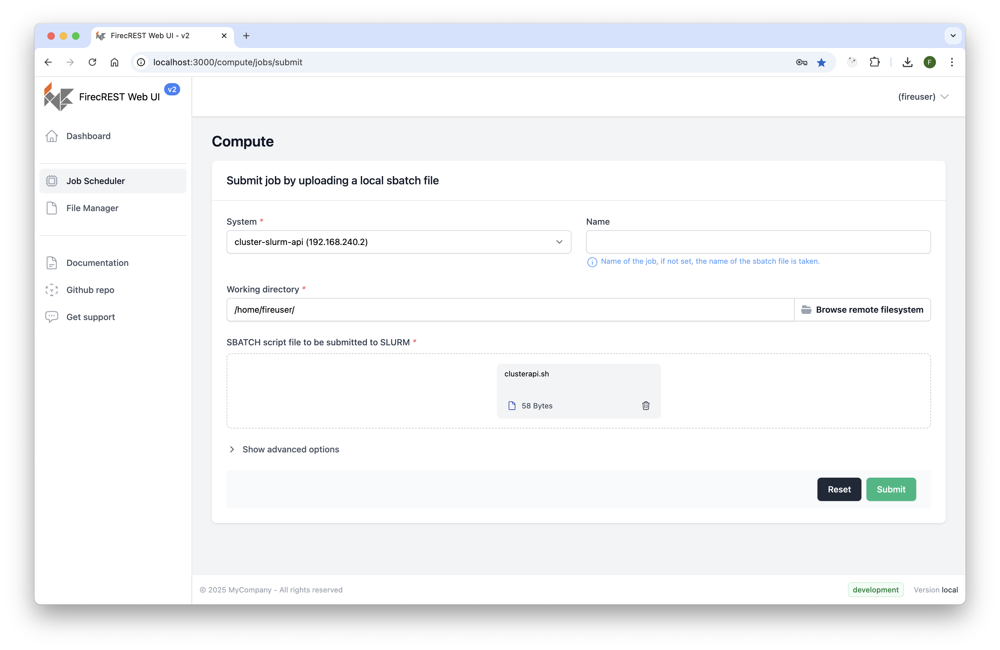
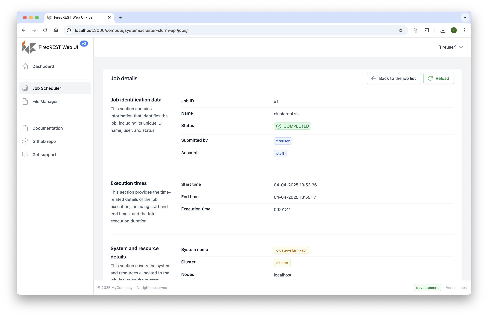
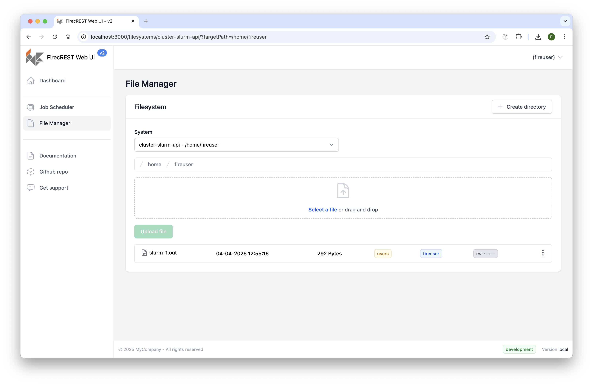

# FirecREST UI Documentation

## Dashboard

The dashboard provides an overview of accessible clusters and their statuses. It also displays currently running jobs.

## Job Scheduler

### Job Scheduler View

The Job Scheduler lists all jobs and includes functionality to schedule new jobs.

### Schedule a Job

The "Submit a Job" button, located at the top-right corner of the Job Scheduler view, opens a form to schedule a new job.

### Job Details

Job details can be viewed on a dedicated page, depending on the job's status. A tabbed interface allows users to view the running script, as well as the standard output and error logs.

## File Manager

The File Manager view lists files on a specific cluster. Users can navigate through the file structure and perform basic file operations (e.g., copy, move). 

Additionally, users can upload or download files. File uploads are handled transparently based on file size:
- Files smaller than 5MB are uploaded directly.
- Larger files require a file upload process involving a scheduled file transfer job (typically via S3 storage).

