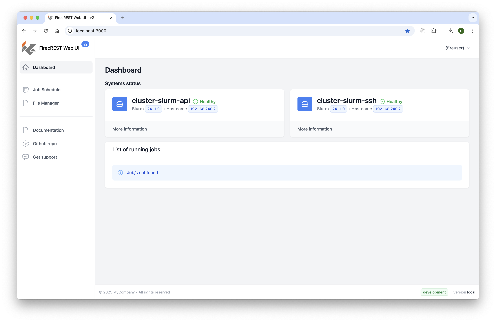

# FirecREST v2 UI

FirecREST UI is a web application designed to provide essential functionalities for interacting with a FirecREST API v2 backend.

FirecREST offers a REST API that enables developers to interact with HPC resources such as schedulers, filesystems, and more. Additionally, it provides methods for authentication, authorization, job execution, file-system operations, and access to accounting or status information.

## Features

- A modern web interface built on FirecREST API functionalities.
- A dashboard offering an overview of configured clusters and their statuses.
- A dedicated view for creating and monitoring jobs.
- A file navigator with basic file management functionalities, including upload and download features.

While the FirecREST API empowers users to build complex workflows, a workflow manager is not included in the current web interface implementation.

## Benefits

- An open-source web UI compatible with the FirecREST API v2.
- A convenient alternative for monitoring and managing jobs.
- Integration with backend Identity and Access Management (IAM).

## Technologies

📖 Refer to the [Remix documentation](https://remix.run/docs) and the [Remix Vite documentation](https://remix.run/docs/en/main/future/vite) for detailed information on supported features.

## License Notice for Tailwind UI Components

Firecrest-UI includes UI components that may be derived from Tailwind UI, a product by Tailwind Labs. Tailwind UI is subject to its own [Tailwind UI license](https://tailwindui.com/license), which prohibits redistribution of its components and templates.

### What This Means for You
- Firecrest-UI **does not distribute Tailwind UI components or templates directly**.
- If you are using Firecrest-UI and wish to modify or redistribute it, you **must ensure** that any Tailwind UI components you use are covered by a valid Tailwind UI license.
- Tailwind CSS itself is licensed under the **MIT License**, which allows free and open-source usage.

### Compliance Guidelines
- If you have purchased a Tailwind UI license, you may use its components **for your own projects or client work** but **cannot redistribute** them as open-source.
- Ensure that any UI components included in Firecrest-UI are either custom-built or derived from freely available Tailwind CSS styles.

For more details, please refer to the [Tailwind UI License](https://tailwindui.com/license).